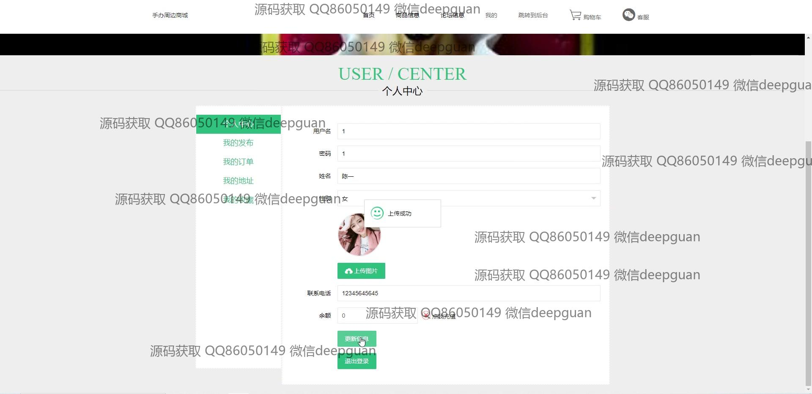
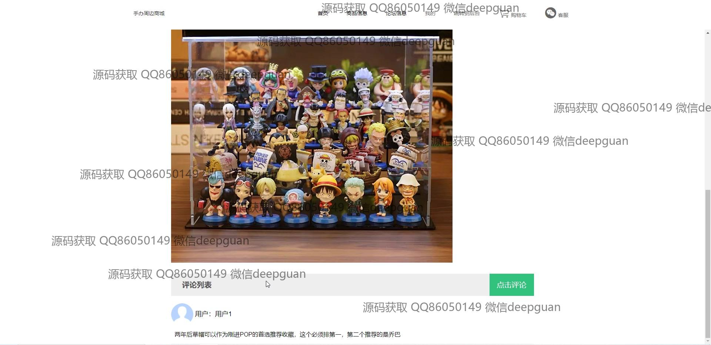

<h1 align="center">的手办周边商城</h1>

## 简介
手办周边商城：角色分为管理员、用户；提供商品信息管理、订单管理、用户论坛、后台管理系统、用户注册登录功能，支持商品展示、购物、评论互动等功能。    --计算机毕业设计源码；毕设源码；java毕业设计源码

## 联系方式

<h3 align="center">获取完整代码与数据库文件 + 微信：deepguan QQ: 86050149 QQ群: 783742310</h3>

<h3 align="center">可帮忙远程部署 包运行成功！提供远程部署、修改代码、设计文档指导、代码讲解等服务！</h3>

## 功能介绍（完整见运行截图）
管理员： 基本功能包括登录、注册和退出。通过管理后台，管理员可以访问商品管理、订单管理、用户管理、论坛管理、系统公告管理以及订单评价管理模块。可以执行商品信息录入、图片上传、商品分类管理、查看订单评价、维护论坛帖子，以及批量删除与修改等操作。导航菜单简洁明确，支持快速搜索商品系列及管理相关信息，提供完善的商城后台管理功能。

用户： 用户可以通过商城前台完成登录、注册和退出操作。网站首页提供主导航栏、轮播图和商品推荐，用户可浏览商品信息并选择收藏、加入购物车或直接购买。个人中心允许用户查看和修改个人信息，管理地址、查看订单和发布的内容。论坛中心支持发帖、评论与交流，商品页面提供商品详情及用户评价查看功能，便于选择购买。

## 运行截图

本代码来源于网络,仅供学习参考使用!

